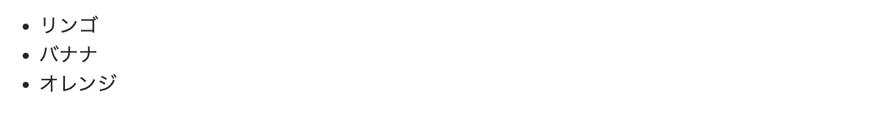

# よくつかうHTMLのプログラミング

## 文字（見出し）


```html
<h1>Hello</h1>
<h2>Hello</h2>
<h3>Hello</h3>
<h4>Hello</h4>
<h5>Hello</h5>
<h6>Hello</h6>
```

## 文字（文章・段落）


```html
<p>Hello. My name is Keisuke.</p>
```

## リンク


```html
<a href="https://www.google.com">Googleを開く</a>
<a href="https://www.youtube.com">YouTubeを開く</a>
```

## ボタン


```html
<button type="button">クリックしてね</button>
<button type="button">もう一度クリックしてね</button>
```

## 画像


```html


```

## 動画


```html
<video width="320" height="240" controls>
  <source src="https://example.com/sample-video.mp4" type="video/mp4">
  ご使用のブラウザはビデオタグをサポートしていません。
</video>
<video width="320" height="240" controls>
  <source src="https://example.com/another-sample-video.mp4" type="video/mp4">
  ご使用のブラウザはビデオタグをサポートしていません。
</video>
```

## 箇条書き




```html
<ul>
  <li>リンゴ</li>
  <li>バナナ</li>
  <li>オレンジ</li>
</ul>

<ol>
  <li>起きる</li>
  <li>歯を磨く</li>
  <li>学校に行く</li>
</ol>
```

## 表


```html
<table border="1">
  <tr>
    <th>科目</th>
    <th>月曜日</th>
    <th>火曜日</th>
    <th>水曜日</th>
    <th>木曜日</th>
    <th>金曜日</th>
  </tr>
  <tr>
    <td>数学</td>
    <td>算数</td>
    <td>図形</td>
    <td>分数</td>
    <td>計算</td>
    <td>テスト</td>
  </tr>
  <tr>
    <td>国語</td>
    <td>読書</td>
    <td>作文</td>
    <td>漢字</td>
    <td>語彙</td>
    <td>テスト</td>
  </tr>
  <tr>
    <td>英語</td>
    <td>アルファベット</td>
    <td>単語</td>
    <td>文法</td>
    <td>リスニング</td>
    <td>テスト</td>
  </tr>
  <tr>
    <td>理科</td>
    <td>植物</td>
    <td>動物</td>
    <td>天気</td>
    <td>実験</td>
    <td>テスト</td>
  </tr>
  <tr>
    <td>社会</td>
    <td>地図</td>
    <td>歴史</td>
    <td>公民</td>
    <td>経済</td>
    <td>テスト</td>
  </tr>
</table>
```

## Bootstrap

### インストール

```html
<head>
    <link href="https://cdn.jsdelivr.net/npm/bootstrap@5.3.0/dist/css/bootstrap.min.css" rel="stylesheet" integrity="sha384-9ndCyUaIbzAi2FUVXJi0CjmCapSmO7SnpJef0486qhLnuZ2cdeRhO02iuK6FUUVM" crossorigin="anonymous">
    <script src="https://cdn.jsdelivr.net/npm/bootstrap@5.3.0/dist/js/bootstrap.bundle.min.js" integrity="sha384-geWF76RCwLtnZ8qwWowPQNguL3RmwHVBC9FhGdlKrxdiJJigb/j/68SIy3Te4Bkz" crossorigin="anonymous"></script>
</head>
```

### ボタン


```html
<button type="button" class="btn btn-primary">国語テストを開始</button>
<button type="button" class="btn btn-secondary">英語テストを開始</button>
<button type="button" class="btn btn-success">理科テストを開始</button>
<button type="button" class="btn btn-danger">社会テストを開始</button>
```

### 入力フォーム


```html
<form>
  <div class="mb-3">
    <label for="studentName" class="form-label">名前</label>
    <input type="text" class="form-control" id="studentName" placeholder="名前を入力してください">
  </div>
  <div class="mb-3">
    <label for="studentClass" class="form-label">クラス</label>
    <select class="form-select" id="studentClass">
      <option selected>クラスを選択してください</option>
      <option value="1">1年生</option>
      <option value="2">2年生</option>
      <option value="3">3年生</option>
      <option value="4">4年生</option>
      <option value="5">5年生</option>
      <option value="6">6年生</option>
    </select>
  </div>
  <div class="mb-3">
    <label for="testSubject" class="form-label">テストの科目</label>
    <select class="form-select" id="testSubject">
      <option selected>科目を選択してください</option>
      <option value="国語">国語</option>
      <option value="数学">数学</option>
      <option value="英語">英語</option>
      <option value="理科">理科</option>
      <option value="社会">社会</option>
    </select>
  </div>
  <button type="submit" class="btn btn-primary">送信</button>
</form>
```

### 表


```html
<table class="table">
  <thead>
    <tr>
      <th scope="col">#</th>
      <th scope="col">科目</th>
      <th scope="col">日時</th>
      <th scope="col">教室</th>
    </tr>
  </thead>
  <tbody>
    <tr>
      <th scope="row">1</th>
      <td>国語</td>
      <td>2023年3月10日 9:00</td>
      <td>A101</td>
    </tr>
    <tr>
      <th scope="row">2</th>
      <td>数学</td>
      <td>2023年3月10日 10:30</td>
      <td>A102</td>
    </tr>
    <tr>
      <th scope="row">3</th>
      <td>英語</td>
      <td>2023年3月10日 13:00</td>
      <td>A103</td>
    </tr>
    <tr>
      <th scope="row">4</th>
      <td>理科</td>
      <td>2023年3月11日 9:00</td>
      <td>B101</td>
    </tr>
    <tr>
      <th scope="row">5</th>
      <td>社会</td>
      <td>2023年3月11日 10:30</td>
      <td>B102</td>
    </tr>
  </tbody>
</table>
```

### ナビゲーションバー


```html
<nav class="navbar navbar-expand-lg navbar-light bg-light">
  <a class="navbar-brand" href="#">学校のウェブサイト</a>
  <button class="navbar-toggler" type="button" data-toggle="collapse" data-target="#navbarNav" aria-controls="navbarNav" aria-expanded="false" aria-label="Toggle navigation">
    <span class="navbar-toggler-icon"></span>
  </button>
  <div class="collapse navbar-collapse" id="navbarNav">
    <ul class="navbar-nav">
      <li class="nav-item active">
        <a class="nav-link" href="#">ホーム <span class="sr-only">(current)</span></a>
      </li>
      <li class="nav-item">
        <a class="nav-link" href="#">時間割</a>
      </li>
      <li class="nav-item">
        <a class="nav-link" href="#">お知らせ</a>
      </li>
      <li class="nav-item">
        <a class="nav-link" href="#">連絡先</a>
      </li>
    </ul>
  </div>
</nav>
```

### モーダル


```html
<!-- モーダル - 数学テスト -->
<div class="modal fade" id="mathModal" tabindex="-1" aria-labelledby="mathModalLabel" aria-hidden="true">
  <div class="modal-dialog">
    <div class="modal-content">
      <div class="modal-header">
        <h5 class="modal-title" id="mathModalLabel">数学テスト</h5>
        <button type="button" class="btn-close" data-bs-dismiss="modal" aria-label="Close"></button>
      </div>
      <div class="modal-body">
        数学テストを始めます。準備はいいですか？
      </div>
      <div class="modal-footer">
        <button type="button" class="btn btn-secondary" data-bs-dismiss="modal">閉じる</button>
        <button type="button" class="btn btn-primary">始める</button>
      </div>
    </div>
  </div>
</div>
<!-- モーダル - 美術テスト -->
<div class="modal fade" id="artModal" tabindex="-1" aria-labelledby="artModalLabel" aria-hidden="true">
  <div class="modal-dialog">
    <div class="modal-content">
      <div class="modal-header">
        <h5 class="modal-title" id="artModalLabel">美術テスト</h5>
        <button type="button" class="btn-close" data-bs-dismiss="modal" aria-label="Close"></button>
      </div>
      <div class="modal-body">
        美術テストを始めます。色鉛筆は準備できましたか？
      </div>
      <div class="modal-footer">
        <button type="button" class="btn btn-secondary" data-bs-dismiss="modal">閉じる</button>
        <button type="button" class="btn btn-primary">始める</button>
      </div>
    </div>
  </div>
</div>
```
